# System Architecture

> **Note:** This document covers both **PoC (Proof of Concept)** and **Production** architectures.
> - **PoC:** Synchronous, Streamlit-based, single-instance (current implementation)
> - **Production:** Asynchronous, FastAPI + React, multi-instance (Week 6+ migration)
>
> See [PoC vs Production Comparison](#poc-vs-production-architecture-comparison) for detailed differences.

---

## High-Level Architecture Diagram (PoC)

```mermaid
graph TB
    User[👤 Business User] --> UI[🖥️ Streamlit Web UI]

    UI --> QH[📝 Query Handler<br/>Prompt Builder]
    QH --> Schema[(📊 Schema<br/>Manager)]

    QH --> LLM[🤖 LLM Service<br/>OpenAI GPT-4o-mini]
    LLM --> OpenAI[☁️ OpenAI API]

    OpenAI --> LLM
    LLM --> Validator[🛡️ SQL Validator<br/>Security Checks]

    Validator --> Engine[⚙️ Query Engine<br/>PandasSQL/PostgreSQL]
    Engine --> DB[(💾 Data Layer<br/>Pandas/PostgreSQL)]

    DB --> Engine
    Engine --> Results[📊 Results Formatter]
    Results --> UI

    LLM -.Log.-> Monitor[📈 Monitoring<br/>LangFuse/Helicone]
    Validator -.Log.-> Monitor
    Engine -.Log.-> Monitor

    style User fill:#e1f5ff
    style UI fill:#fff4e1
    style LLM fill:#f0e1ff
    style DB fill:#e1ffe1
    style Monitor fill:#ffe1e1
```



## Component Architecture


## Data Flow Diagram


## Security Architecture


## Deployment Architecture (Production)

```mermaid
graph TB
    subgraph "Azure Cloud"
        subgraph "App Service"
            APP1[App Instance 1]
            APP2[App Instance 2]
        end

        LB[Load Balancer]

        subgraph "Database"
            PG[PostgreSQL<br/>Flexible Server]
            BACKUP[Automated Backups]
        end

        subgraph "Monitoring"
            AI[Application Insights]
            LF[LangFuse]
        end

        subgraph "Security"
            KV[Key Vault<br/>API Keys]
            WAF[Web Application<br/>Firewall]
        end
    end

    Internet[🌐 Internet] --> WAF
    WAF --> LB
    LB --> APP1
    LB --> APP2

    APP1 --> KV
    APP2 --> KV

    APP1 --> PG
    APP2 --> PG

    PG --> BACKUP

    APP1 -.logs.-> AI
    APP2 -.logs.-> AI
    APP1 -.llm logs.-> LF
    APP2 -.llm logs.-> LF

    style Internet fill:#e1f5ff
    style WAF fill:#ffcccc
    style KV fill:#ffcccc
```



## Technology Stack Layers


## Module Dependency Graph


## Error Handling Flow


## Observability Stack


## PoC vs Production Architecture Comparison

### PoC Architecture (Current - Synchronous)

```
User → Streamlit UI → Python App (Sync) → openai.OpenAI → OpenAI API
                            ↓                   (blocking)
                       PandasSQL
                            ↓
                    In-Memory DataFrame
```

**Key Characteristics:**
- Single-threaded, synchronous execution
- Each request blocks until OpenAI responds (~2s)
- In-memory data (13,152 rows in RAM)
- 5-10 concurrent users maximum
- Simple deployment (single instance)

---

### Production Architecture (Target - Asynchronous)

```mermaid
graph TB
    subgraph "Frontend Layer"
        User[👤 User] --> LB[🔄 Load Balancer]
        LB --> UI1[React/Vue SPA 1]
        LB --> UI2[React/Vue SPA 2]
    end

    subgraph "API Layer - FastAPI (Async)"
        UI1 --> API1[FastAPI Instance 1<br/>async def endpoints]
        UI2 --> API2[FastAPI Instance 2<br/>async def endpoints]
    end

    subgraph "Service Layer - Async"
        API1 --> AsyncLLM1[AsyncOpenAI Client]
        API2 --> AsyncLLM2[AsyncOpenAI Client]
        AsyncLLM1 --> OpenAI[☁️ OpenAI API]
        AsyncLLM2 --> OpenAI
    end

    subgraph "Data Layer - Async"
        API1 --> Pool1[asyncpg<br/>Connection Pool]
        API2 --> Pool2[asyncpg<br/>Connection Pool]
        Pool1 --> PG[(PostgreSQL<br/>Flexible Server)]
        Pool2 --> PG
    end

    subgraph "Observability"
        AsyncLLM1 -.logs.-> LF[LangFuse<br/>LLM Tracing]
        AsyncLLM2 -.logs.-> LF
        API1 -.metrics.-> AppInsights[Application Insights]
        API2 -.metrics.-> AppInsights
    end

    style User fill:#e1f5ff
    style LB fill:#ffe1e1
    style API1 fill:#f0e1ff
    style API2 fill:#f0e1ff
    style PG fill:#e1ffe1
```



**Key Characteristics:**
- **Async/await pattern:** Non-blocking I/O
- **FastAPI backend:** RESTful API with async endpoints
- **AsyncOpenAI:** Multiple concurrent LLM requests
- **asyncpg:** Fast async PostgreSQL driver (3-5× faster)
- **Horizontal scaling:** 100+ concurrent users
- **Load balanced:** Multiple backend instances
- **Connection pooling:** Reuse DB connections

---

### Technology Stack Comparison

| Component | PoC (Sync) | Production (Async) |
|-----------|-----------|-------------------|
| **Frontend** | Streamlit (Python) | React/Vue.js SPA |
| **Backend** | Embedded in Streamlit | FastAPI (async) |
| **OpenAI Client** | `openai.OpenAI` (sync) | `openai.AsyncOpenAI` |
| **Database** | PandasSQL (in-memory) | PostgreSQL 14+ |
| **DB Driver** | N/A | asyncpg 0.29+ |
| **Concurrency Model** | Single-threaded | Async/await (asyncio) |
| **Max Users** | 5-10 | 100+ (with scaling) |
| **Response Time** | 2s (blocking) | 1.5s (non-blocking UI) |
| **Deployment** | Single instance | Multi-instance + LB |

## Scaling Strategy


---

## Key Design Decisions

### 1. Direct API Integration (No Heavy Frameworks)

**Decision:** Use direct OpenAI API calls instead of LangChain/LlamaIndex

**Rationale:**
- ✅ Full control over prompts and logic
- ✅ Minimal dependencies
- ✅ Easier debugging
- ✅ No vendor lock-in
- ✅ Faster development for simple use case

### 2. PandasSQL for PoC, PostgreSQL for Production

**Decision:** Start with in-memory PandasSQL, migrate to PostgreSQL

**Rationale:**
- ✅ Faster PoC development (no DB setup)
- ✅ Easy transition (same SQL syntax)
- ✅ Production-ready database for scale
- ✅ Clear upgrade path

### 3. Streamlit (PoC) → FastAPI + React (Production)

**Decision:** Start with Streamlit for PoC, migrate to FastAPI + React for production

**PoC Rationale (Streamlit):**
- ✅ Rapid development (build in days, not weeks)
- ✅ Python-native (low learning curve for data teams)
- ✅ Built-in components for data apps
- ✅ Auto-refresh and state management

**Production Rationale (FastAPI + React):**
- ✅ **Async support:** FastAPI enables async/await for non-blocking I/O
- ✅ **Scalability:** Handle 100+ concurrent users with AsyncOpenAI
- ✅ **REST API:** Separate frontend/backend for flexibility
- ✅ **Enterprise UI:** React/Vue provides professional UX
- ✅ **Performance:** 3-5× faster with asyncpg vs sync drivers

**Migration Path:**
- Week 1-5: Streamlit PoC (sync)
- Week 6: Migrate to FastAPI backend (async)
- Week 7-8: Optional React/Vue frontend (can keep Streamlit if sufficient)

### 4. GPT-4o-mini Instead of GPT-4

**Decision:** Use GPT-4o-mini for cost-effectiveness

**Rationale:**
- ✅ 20× cheaper ($0.15 vs $3/1M tokens)
- ✅ Sufficient accuracy for text-to-SQL (85-95%)
- ✅ Faster response times
- ✅ Can upgrade specific queries to GPT-4 if needed

### 5. Multi-Layer Security Validation

**Decision:** Validate SQL at multiple points

**Rationale:**
- ✅ Defense in depth
- ✅ Prevent SQL injection
- ✅ Block dangerous operations
- ✅ Audit trail for compliance

---

## Async Migration Strategy

### Why Migrate from Sync to Async?

**PoC Limitations (Synchronous):**
- ❌ Blocks on every OpenAI API call (~2s per request)
- ❌ Single-threaded = only 1 user at a time gets full performance
- ❌ 5-10 concurrent users max before severe degradation
- ❌ Poor resource utilization (CPU idle while waiting for I/O)

**Production Benefits (Asynchronous):**
- ✅ Non-blocking I/O = handle 100+ concurrent users
- ✅ Better resource utilization (handle multiple requests simultaneously)
- ✅ Improved response times under load
- ✅ Horizontal scaling with load balancers

### Migration Checklist (Week 6)

#### 1. Replace Synchronous OpenAI Client

**Before (PoC):**
```python
# src/llm_service.py
from openai import OpenAI

class LLMService:
    def __init__(self, api_key: str):
        self.client = OpenAI(api_key=api_key)

    def generate_sql(self, system_prompt: str, user_prompt: str) -> str:
        response = self.client.chat.completions.create(...)  # BLOCKS here
        return response.choices[0].message.content
```

**After (Production):**
```python
# src/llm_service_async.py
from openai import AsyncOpenAI
import asyncio

class AsyncLLMService:
    def __init__(self, api_key: str):
        self.client = AsyncOpenAI(api_key=api_key)

    async def generate_sql(self, system_prompt: str, user_prompt: str) -> str:
        response = await self.client.chat.completions.create(...)  # NON-BLOCKING
        return response.choices[0].message.content
```

#### 2. Migrate to FastAPI Backend

**Before (PoC):**
```python
# app.py - Streamlit
import streamlit as st

if st.button("Ask"):
    result = llm_service.generate_sql(...)  # Sync call
    st.write(result)
```

**After (Production):**
```python
# backend/main.py - FastAPI
from fastapi import FastAPI

app = FastAPI()

@app.post("/api/query")
async def query_data(question: str):
    # All async operations
    sql = await llm_service.generate_sql(...)
    result = await db.execute(sql)
    return {"sql": sql, "result": result}
```

#### 3. Replace PandasSQL with PostgreSQL + asyncpg

**Before (PoC):**
```python
# app.py
import pandasql as ps

result = ps.sqldf(sql, locals_dict)  # Sync, in-memory
```

**After (Production):**
```python
# backend/database.py
import asyncpg

pool = await asyncpg.create_pool(
    host='postgres.azure.com',
    database='accrual_data'
)

async def execute_query(sql: str):
    async with pool.acquire() as conn:
        result = await conn.fetch(sql)  # Async query
        return result
```

#### 4. Add Connection Pooling

```python
# backend/database.py
class DatabasePool:
    def __init__(self):
        self.pool = None

    async def connect(self):
        self.pool = await asyncpg.create_pool(
            min_size=5,      # Keep 5 connections open
            max_size=20,     # Max 20 concurrent connections
            timeout=30
        )

    async def execute(self, sql: str):
        async with self.pool.acquire() as conn:
            return await conn.fetch(sql)
```

### Performance Impact

| Metric | Sync (PoC) | Async (Production) | Improvement |
|--------|-----------|-------------------|-------------|
| **Single Request** | 2.0s | 1.8s | 10% faster |
| **10 Concurrent** | 20s total | 2.5s total | **8× faster** |
| **100 Concurrent** | 200s total | 5s total | **40× faster** |
| **Max Users** | 5-10 | 100+ | **10× capacity** |
| **CPU Utilization** | 20% (idle waiting) | 80% (active) | **4× efficiency** |

---

## Performance Considerations

### Query Response Time Breakdown

#### PoC (Synchronous)

| Stage | Target Time | Notes |
|-------|-------------|-------|
| Prompt Building | <50ms | In-memory operation |
| OpenAI API Call | 1000-2000ms | **BLOCKING** - entire thread waits |
| SQL Validation | <10ms | Regex + parsing |
| Query Execution | 100-500ms | PandasSQL in-memory |
| Result Formatting | <50ms | Pandas operations |
| **Total** | **~2 seconds** | Single-threaded |

#### Production (Asynchronous)

| Stage | Target Time | Notes |
|-------|-------------|-------|
| Prompt Building | <50ms | In-memory operation |
| OpenAI API Call | 1000-1500ms | **NON-BLOCKING** - other requests proceed |
| SQL Validation | <10ms | Regex + parsing |
| Query Execution | 50-200ms | PostgreSQL + asyncpg (faster) |
| Result Formatting | <50ms | Pandas operations |
| **Total** | **~1.5 seconds** | But handles 100+ concurrent |

### Optimization Strategies

#### PoC Optimizations:
1. **Prompt Caching** - Cache schema descriptions (reduces tokens)
2. **Minimal Dependencies** - Fast startup time

#### Production Optimizations:
3. **Connection Pooling** - Reuse DB connections (asyncpg pool)
4. **Async Processing** - Non-blocking OpenAI calls (AsyncOpenAI)
5. **Result Caching** - Cache common queries (Redis)
6. **Query Optimization** - Index frequently queried columns
7. **Horizontal Scaling** - Multiple FastAPI instances behind load balancer
8. **CDN for Frontend** - Serve React/Vue from CDN

---

## Disaster Recovery

### Backup Strategy


### Recovery Time Objectives

| Scenario | RTO | RPO | Strategy |
|----------|-----|-----|----------|
| App Server Failure | <1 min | 0 | Auto-restart, load balancer |
| Database Failure | <5 min | <1 min | Standby promotion |
| Region Failure | <30 min | <5 min | Cross-region replica |
| Data Corruption | <2 hours | <24 hours | Point-in-time restore |

---

This architecture ensures a robust, scalable, and maintainable system that can grow from PoC to enterprise production deployment.
